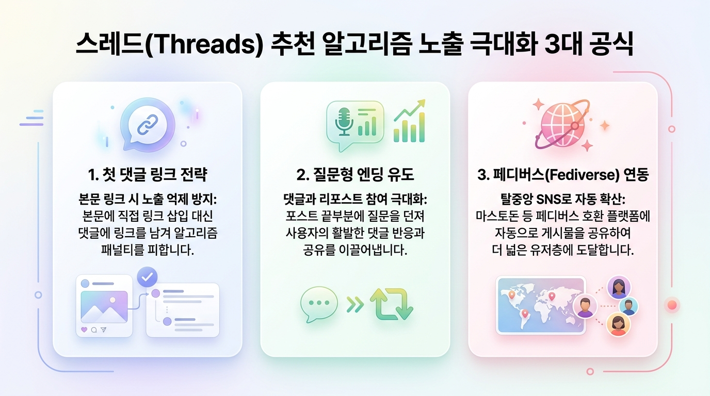
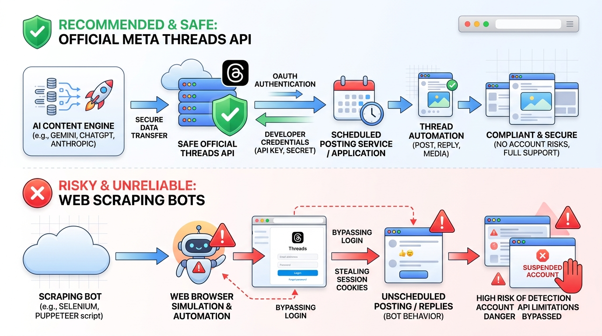

# 🚀 인스타그램 & 스레드 신규 계정 생성 및 AI 자동화 완벽 가이드

> **휴면 계정 보유 상태에서 신규 계정 안전 생성, 계정 웜업(Warm-up), 스레드 추천 알고리즘 공략, 그리고 공식 Threads API 기반 AI 자동화 파이프라인 구축을 위한 종합 레퍼런스입니다.**

<br />

<p align="center">
  
</p>

---

## 📌 목차
1. [기존 계정 보유 시 신규 계정(B) 추가 팁](#1-기존-계정-보유-시-신규-계정b-추가-팁)
2. [차단·정지 방지를 위한 '계정 웜업(Warm-up)' 5일 프로토콜](#2-차단정지-방지를-위한-계정-웜업warm-up-5일-프로토콜)
3. [스레드(Threads) 추천 알고리즘 3대 공략법](#3-스레드threads-추천-알고리즘-3대-공략법)
4. [AI 자동화 아키텍처: 공식 API vs 웹 매크로](#4-ai-자동화-아키텍처-공식-api-vs-웹-매크로)
5. [공식 Threads API 2단계 포스팅 파이썬 코드](#5-공식-threads-api-2단계-포스팅-파이썬-코드)
6. [단계별 실행 체크리스트](#6-단계별-실행-체크리스트)

---

## 1. 기존 계정 보유 시 신규 계정(B) 추가 팁

### 🔹 1. 전화번호 및 이메일 재사용 규칙
| 항목 | 재사용 여부 | 설명 및 권장 방법 |
| :--- | :---: | :--- |
| **전화번호** | **재사용 가능 (O)** | 기존 A 계정에 등록된 휴대폰 번호로 B 계정 본인 인증 가능 |
| **이메일** | **별도 이메일 권장 (△)** | 동일 이메일 가입 시 기존 계정 연동 문제 발생. **Gmail Alias(+단어)** 활용 |
| **동시 다계정 지원** | **최대 5개 (O)** | 인스타그램 앱 1대 기기에서 계정 간 원터치 전환 기본 지원 |

#### 💡 Gmail 별칭(Alias) 활용 꿀팁
새로운 이메일을 가입할 필요 없이 기존 Gmail 주소에 `+` 태그를 붙여 독립 계정으로 등록할 수 있습니다.
- 기존 이메일: `myaccount@gmail.com`
- 신규 가입 이메일: `myaccount+threads@gmail.com`
- *결과:* 인증 메일은 본래 수신함으로 오면서 인스타그램은 새로운 이메일로 인식합니다.

### 🔹 2. 보안 및 Meta 계정 센터 분리
- **계정 센터 연동 분리:** 앱에서 신규 생성 시 "기존 계정과 로그인 공유"를 하지 말고 **"독립 아이디/비밀번호로 신규 가입"**을 선택하세요. (추후 개발자 API 권한 분리에 필수)
- **2단계 인증(2FA)은 인증 앱(OTP) 등록:** SMS 대신 Google Authenticator 또는 1Password를 연동하면 의심 세션 검증(Checkpoint) 시 빠르게 인증을 통과할 수 있습니다.
- **프로페셔널(크리에이터) 계정 전환:** 설정에서 프로페셔널 계정으로 변경해야 Meta Developer 센터에서 Threads API 권한을 안정적으로 부여받을 수 있고 인사이트 통계를 조회할 수 있습니다.

---

## 2. 차단·정지 방지를 위한 '계정 웜업(Warm-up)' 5일 프로토콜

> ⚠️ **주의:** 신규 생성 계정에 즉시 대량 자동 글 게시를 시도하면 **90% 이상 확률로 스팸 봇으로 감지되어 영구 정지(Shadowban)**됩니다.

### 📅 웜업 5일 표준 스케줄
- **Day 1 (프로필 완성 & 첫 글):**
  - 고화질 프로필 사진 등록, 타겟팅된 Bio(소개글) 작성
  - 일상/생각을 담은 자연스러운 글 1개 수동 작성 (외부 링크 절대 포함 금지)
- **Day 2 (자연스러운 탐색):**
  - 관심사 관련 피드 글 5~10개 열람, 마음에 드는 글에 좋아요 2~3개 및 정성 댓글 1개 작성
- **Day 3 (소통 & 질문 글):**
  - 관심 분야에 대한 짧은 인사이트 + 독자 의견을 묻는 질문 글 1개 작성
  - 맞팔 소통 (단기간 수십 명 연속 팔로우는 금지, 3~5명 이내)
- **Day 4 (개발자 센터 등록):**
  - Meta for Developers에서 Threads API 앱 생성 및 기본 권한(Basic Display) 신청
- **Day 5 (API 테스트 & 정착):**
  - 공식 Threads API로 하루 1회 테스트 포스팅 시작 (정각이 아닌 랜덤 시간 분산)

---

## 3. 스레드(Threads) 추천 알고리즘 3대 공략법

<p align="center">
  
</p>

### 1️⃣ 첫 댓글 링크 전략 (Link in First Comment)
- 스레드 알고리즘은 **외부 URL 링크가 본문에 포함된 글의 도달률(Reach)을 현저히 낮춥니다.**
- **공략법:** 본문에는 인사이트와 요약 글만 작성하고, *"상세 링크는 첫 번째 댓글에 남겨둘게요!"* 형태로 작성한 뒤 **첫 대댓글에 링크를 첨부**하세요.

### 2️⃣ 질문형 엔딩 (Engagement Trigger)
- 스레드 추천 피드(For You)는 **댓글 수와 리포스트(재게시)** 비율에 가장 높은 가중치를 둡니다.
- **공략법:** AI 프롬프트 생성 규칙에 반드시 본문 마지막을 **"여러분은 어떤 방법을 더 선호하시나요?"**, **"여러분의 경험은 어떠셨나요?"**와 같은 열린 질문으로 끝나도록 설계하세요.

### 3️⃣ 페디버스(Fediverse) 공유 활성화
- 설정 > 계정 > 페디버스 공유를 켜두면 마스토돈 등 타 탈중앙화 SNS 네트워크로 글이 자동 분산 전파되어 추가 유입을 얻을 수 있습니다.

---

## 4. AI 자동화 아키텍처: 공식 API vs 웹 매크로

<p align="center">
  
</p>

### 🛡️ 왜 공식 Threads API를 써야 하는가?
- **웹 매크로 (Selenium, Puppeteer 등):** Meta의 봇 탐지 AI(Fingerprinting, Cloudflare)에 의해 즉시 세션이 만료되고 계정이 영구 정지됩니다.
- **공식 Threads Graph API:** Meta가 공식 승인한 표준 REST API로 영구 정지 위험 없이 무제한 안전하게 자동 포스팅을 유지할 수 있습니다.

### ⚙️ 추천 자동화 스택
1. **완전 무료/개발자 맞춤형:** Google Gemini API + Python + GitHub Actions (Cron 스케줄러)
2. **빠른 노코드 구축형:** Google Sheet (주제 DB) + Make.com (OpenAI 모듈) + Threads API (HTTP 모듈)

---

## 5. 공식 Threads API 2단계 포스팅 파이썬 코드

스레드 공식 API는 **① 미디어 컨테이너 생성 ➔ ② 컨테이너 발행(Publish)**의 2단계로 진행됩니다.

```python
import os
import time
import random
import requests
from google import genai

# 1. API 키 및 토큰 환경변수 로드
GEMINI_API_KEY = os.getenv("GEMINI_API_KEY")
THREADS_USER_ID = os.getenv("THREADS_USER_ID")
THREADS_ACCESS_TOKEN = os.getenv("THREADS_ACCESS_TOKEN")

# 2. AI 글 생성 (Google Gemini)
def generate_thread_content(topic: str) -> str:
    client = genai.Client(api_key=GEMINI_API_KEY)
    prompt = f"""
    주제: {topic}
    - 스레드 SNS용으로 3~5줄 내외의 친근하고 유익한 글을 작성해줘.
    - 문체: 친근한 대화체 (~해요, ~더라고요)
    - 외부 링크는 절대 포함하지 말 것.
    - 마지막 문장은 독자의 참여를 유도하는 질문으로 끝낼 것.
    """
    response = client.models.generate_content(
        model="gemini-2.5-flash",
        contents=prompt
    )
    return response.text.strip()

# 3. 공식 Threads API 포스팅 함수
def publish_to_threads(text_content: str):
    # 정각 포스팅 회피: 1~5분 랜덤 지연
    jitter = random.randint(60, 300)
    print(f"안전 대기 중... ({jitter}초)")
    time.sleep(jitter)

    # Step 1: 컨테이너 생성
    creation_url = f"https://graph.threads.net/v1.0/{THREADS_USER_ID}/threads"
    creation_payload = {
        "media_type": "TEXT",
        "text": text_content,
        "access_token": THREADS_ACCESS_TOKEN
    }
    create_res = requests.post(creation_url, data=creation_payload).json()
    container_id = create_res.get("id")

    if not container_id:
        raise Exception(f"컨테이너 생성 실패: {create_res}")

    print(f"컨테이너 생성 완료 (ID: {container_id}), 발행 처리 대기...")
    time.sleep(5)

    # Step 2: 스레드 발행
    publish_url = f"https://graph.threads.net/v1.0/{THREADS_USER_ID}/threads_publish"
    publish_payload = {
        "creation_id": container_id,
        "access_token": THREADS_ACCESS_TOKEN
    }
    publish_res = requests.post(publish_url, data=publish_payload).json()
    print(f"🎉 스레드 발행 성공! Post ID: {publish_res.get('id')}")
    return publish_res

if __name__ == "__main__":
    test_topic = "생산성을 높이는 AI 도구 3가지 추천"
    content = generate_thread_content(test_topic)
    print("생성된 본문:\n", content)
    # publish_to_threads(content)
```

---

## 6. 단계별 실행 체크리스트

- [ ] **계정 생성:** Gmail Alias(`+alias`)로 독립 인스타 계정(B) 가입
- [ ] **보안 설정:** Google Authenticator OTP 2단계 인증 등록
- [ ] **프로페셔널 전환:** 인스타그램 크리에이터 계정으로 변경
- [ ] **3~5일 웜업:** 일상 수동 글 작성, 피드 탐색, 좋아요/소통으로 신뢰도 확보
- [ ] **스레드 세팅:** 프로필 Bio 완성 및 페디버스 공유 On
- [ ] **Meta 개발자 등록:** Meta for Developers 앱 생성 및 Threads Long-lived Token 발급
- [ ] **AI 파이프라인 배포:** Gemini API 연동 및 GitHub Actions 스케줄러 가동

---

<p align="center">
  <b>Bright Mode Desktop Web Edition:</b> <code>index.html</code>을 브라우저에서 열면 macOS 스타일의 인터랙티브 대시보드로 열람할 수 있습니다.
</p>